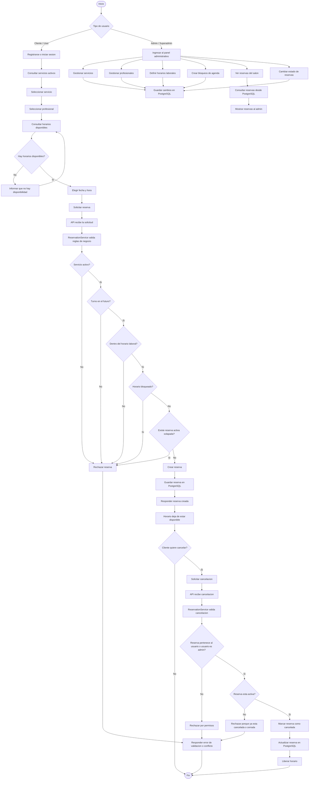

# Diagrama de Flujo del Sistema de Reservas

## Objetivo del Diagrama

Este documento describe el flujo principal del sistema web de reservas para un salon de estetica. El objetivo es explicar, de forma clara y presentable, como interactuan el cliente, el administrador, la API backend, las reglas de negocio y la base de datos.

El sistema esta pensado como un proyecto academico de metodologia de pruebas. Por eso el flujo no se limita a mostrar pantallas o acciones de usuario, sino que tambien destaca las validaciones que deben ser cubiertas mediante tests automatizados con PHPUnit.

---

## Diagrama General



---

## Explicacion del Flujo

El sistema comienza identificando el tipo de usuario. Si el usuario es cliente, puede registrarse o iniciar sesion, consultar los servicios activos del salon, elegir un profesional y revisar los horarios disponibles. Si el usuario es administrador o superadministrador, accede a funciones internas como gestionar servicios, definir horarios laborales, bloquear horarios y consultar reservas.

Cuando un cliente solicita una reserva, la API no crea el turno directamente. Primero envia la solicitud a la capa de servicios, especialmente a `ReservationService`, donde se concentran las reglas de negocio. Esta decision es importante porque permite probar las validaciones principales con PHPUnit sin depender necesariamente de una interfaz visual.

Las validaciones centrales son:

- El servicio debe estar activo.
- La fecha y hora solicitada no puede estar en el pasado.
- El turno debe estar dentro del horario laboral del profesional.
- El horario no debe estar bloqueado.
- No debe existir una reserva activa que se solape con el mismo profesional.

Si alguna regla falla, el sistema rechaza la reserva y responde con un error de validacion, permisos o conflicto, segun corresponda. Si todas las reglas se cumplen, la reserva se guarda en PostgreSQL y ese horario deja de estar disponible para futuras reservas.

El flujo de cancelacion tambien tiene reglas propias. El sistema verifica que el usuario tenga permiso para cancelar la reserva y que la reserva siga activa. Si la reserva ya estaba cancelada, no puede volver a cancelarse. Si la cancelacion es valida, el estado de la reserva cambia a `cancelled` y el horario vuelve a quedar disponible.

---

## Relacion con la Arquitectura del Backend

El diagrama se apoya en una arquitectura por capas:

```text
Request HTTP
  -> Controller
  -> Service
  -> Repository
  -> PostgreSQL
  -> Response JSON
```

### Controllers

Reciben las solicitudes HTTP, validan datos basicos y devuelven respuestas JSON. No deben contener las reglas principales del negocio.

### Services

Contienen la logica central del sistema. En esta capa se validan disponibilidad, conflictos de horarios, cancelaciones, permisos y estados de reserva.

### Repositories

Se encargan de leer y escribir datos en PostgreSQL mediante PDO. Separan el acceso a datos de las reglas de negocio.

### PostgreSQL

Persiste usuarios, servicios, profesionales, horarios laborales, reservas y bloqueos de agenda.

---

## Relacion con Testing

El flujo fue pensado para que cada decision importante pueda transformarse en un caso de prueba automatizado.

### Pruebas unitarias sugeridas

- Crear una reserva valida dentro del horario laboral.
- Rechazar una reserva en el pasado.
- Rechazar una reserva fuera del horario laboral.
- Rechazar una reserva para un servicio inactivo.
- Rechazar una reserva cuando existe solapamiento.
- Rechazar una reserva cuando el horario esta bloqueado.
- Cancelar una reserva activa.
- Rechazar la cancelacion de una reserva ya cancelada.
- Rechazar la cancelacion de una reserva ajena.

### Pruebas de integracion sugeridas

Un flujo completo de integracion podria ejecutar:

1. Crear un servicio activo.
2. Crear un profesional.
3. Definir horario laboral.
4. Consultar disponibilidad.
5. Crear una reserva.
6. Intentar reservar el mismo horario.
7. Confirmar que el sistema rechaza la doble reserva.
8. Cancelar la reserva.
9. Confirmar que el horario vuelve a estar disponible.

---

## Justificacion para Presentacion

Este diagrama esta bien alineado con el objetivo del proyecto porque muestra que el sistema no es solamente un CRUD. La parte mas importante es la toma de decisiones dentro del backend: validar disponibilidad, evitar solapamientos, controlar permisos y mantener estados consistentes.

Tambien permite explicar por que se eligio una arquitectura por capas. Al separar controllers, services y repositories, el proyecto queda mas ordenado, mas facil de mantener y mas facil de testear. Esto es especialmente importante para la materia, ya que el foco esta puesto en metodologia de pruebas y no solamente en construir una interfaz funcional.

En conclusion, el flujo propuesto es adecuado para una primera version del sistema. Cubre el recorrido principal del cliente, las tareas administrativas esenciales y las reglas de negocio que luego deben validarse con pruebas automatizadas.
